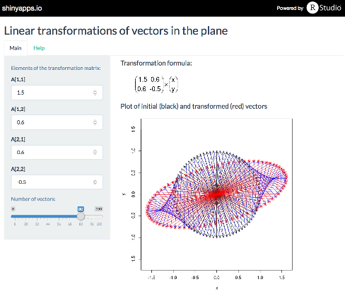

## Developing an intuition for understanding linear transformations of vector spaces

* Linear transformations are a key topic in the mathematics of vector spaces.

* Given a vector $\scriptsize v$ in an $\scriptsize n$-dimensional vector
space $\scriptsize V$, a linear transformation maps it to another vector
$\scriptsize v'$ in another space $\scriptsize V'$ of dimension
$\scriptsize n$ or less. We can write the definition of the transformation
mathematically as a function $\scriptsize T:V\to V'$, where $\scriptsize v'
= T(v)$.

* The theory is abstract and applies to any type of vector space, but we can
develop an intuition by considering particular examples of vector spaces that
can be easily visulaized.

---

## Real vector spaces

* The first step is to consider transformations in spaces of real numbers,
i.e. $\scriptsize T:R^n\to R^n$. In this case the transformation can be written
as the matrix product: $$\scriptsize v' = Av$$

* We can take one step further and choose $\scriptsize n = 2$, i.e. we consider
vectors in the plane $\scriptsize R^2$, which can be represented visually in a
2-D plot.

* Computing the linear transformation in the plane is done as follows:

$$\scriptsize
v = \begin{pmatrix} x \\ y \end{pmatrix} ,
A = \begin{pmatrix} a_{11} & a_{12} \\ a_{21} & a_{22} \end{pmatrix}
$$

$$\scriptsize
v' = Av = \begin{pmatrix} a_{11} & a_{12} \\ a_{21} & a_{22} \end{pmatrix}
\begin{pmatrix} x \\ y \end{pmatrix} = \begin{pmatrix} a_{11}x + a_{12}y \\
a_{21}x + a_{22}y \end{pmatrix} = \begin{pmatrix} x' \\ y' \end{pmatrix}
$$


---

## Visualizing transformations of plane vectors

To represent vectors visually, we plot a vector $\tiny v = \begin{pmatrix} x \\
y \end{pmatrix}$ as an arrow starting at the origin of an $\scriptsize x, y$
coordinate system and having its tip at the point of coordinates $\scriptsize
(x,y)$. For example, let's have a look at vector $\tiny v = \begin{pmatrix} 2 \\
1 \end{pmatrix}$. Here are a few linear transformation applied to it:

```{r echo=FALSE, fig.height=5.8,fig.width=5.8, fig.align="center"}
v <- matrix(c(2,1),ncol=1)
cex = 1.2

# plot original vector v
par(mar=c(4,4,1,1))
plot(0,0,
     xlim=c(-4,4), ylim=c(-4,4),pch=NA,xlab="x",ylab="y")
arrows(0,0,v[1],v[2],length=0.1,col="black")
text(2.1,1.6,
  expression(paste("v = ",bgroup("(",atop(2,1),")"))),
  cex = cex, col = "black")

# Scale
A.sc = matrix(c(-2,0,0,-2),ncol=2)
vp.sc = A.sc %*% v
arrows(0,0,vp.sc[1],vp.sc[2],length=0.1,col="blue")
text(-1.3,-1.8,"Scale by a factor of -2:", cex = cex, col = "blue")
text(-1.3,-2.6, expression(paste("A = ", bgroup("(",atop(-2 ~~ 0,0 ~~ -2),")"))),
  cex = cex, col = "blue")

# Stretch
A.st = matrix(c(2,0,0,1),ncol=2)
vp.st = A.st %*% v
arrows(0,0,vp.st[1],vp.st[2],length=0.1,col="red")
text(2.3,-0.3,"Stretch along x axis:", cex = cex, col = "red")
text(2.3,-1.2, expression(paste("A = ", bgroup("(",atop(2 ~~ 0,0 ~~ 1),")"))),
  cex = cex, col = "red")

# Rotate
A.ro = matrix(c(sqrt(3)/2,1/2,-1/2,sqrt(3)/2),ncol=2)
vp.ro = A.ro %*% v
arrows(0,0,vp.ro[1],vp.ro[2],length=0.1,col="green4")
text(-1.3,1.9, expression(paste("Rotate around origin by ",30*degree)),
  cex = cex, col = "green4")
text(-1.3,1, expression(paste("A = ",
  bgroup("(",atop(sqrt(3)/2 ~~ -1/2,1/2 ~~ sqrt(3)/2),")"))),
  cex = cex, col = "green4")
```

---

## RShiny app to visually explore transformations

The app allows setting of the 4 elements of matrix $\scriptsize A$. The
transformation matrix is then applied to a user-defined number of vectors evenly
spaced around the origin. Thus the overall geometric effect of the
transformation can be observed, and the relative influence of each element of
$\scriptsize A$ can be studied.

View the app on <a
href="https://moohbear.shinyapps.io/Developing_Data_Products_2015_08">
shinyapps.io</a>.


